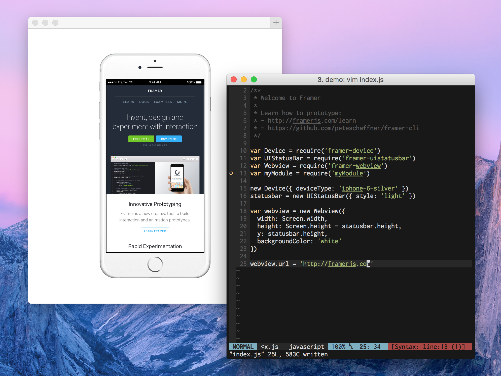

# Framer CLI

> Providing most of the functionality of Framer Studio, but from the comfort of
> your terminal.



Framer CLI is in its infancy, but the aim is to create a decent way to build
quick prototypes/dynamic layouts in code from the editor of your choice. The
current implementation of this tool requires [Node][1].

## Who is this for?

This is not a replacement to [Framer Studio][2] and is best suited for those
who are comfortable with Framer's API and using the command line.

## Features

- CoffeeScript & ECMAScript 6 JS. It will handle CoffeeScript, es6-compliant
JavaScript, or a mix of the two.
- Local server for previewing/debugging.
- Handles true [Node-style modules][3]. Place any code, assets, etc. that you
want in the `modules` folder and `require` them in your main `index.js` file.
Make use of Node modules and third-party Framer modules as well.
- Live reloading when any of the files in your dependency tree change.
- **WIP:** Intelligent completions that are scoped appropriately. This uses
[Tern][4] and requires using an editor with a [Tern plugin][5].
- Quickly generate project and module boilerplate.

## Usage

```bash
$ npm install -g peteschaffner/framer-cli
$ framer path/to/my/project &
$ vim path/to/my/project/index.js
```

The best way to learn is probably to poke around the project and module
boilerplate that `framer(1)` generates. For more detailed instructions,
`framer -h`.

[1]: https://nodejs.org/
[2]: http://framerjs.com/
[3]: https://nodejs.org/api/modules.html#modules_folders_as_modules
[4]: http://ternjs.net/
[5]: http://ternjs.net/#plugins
